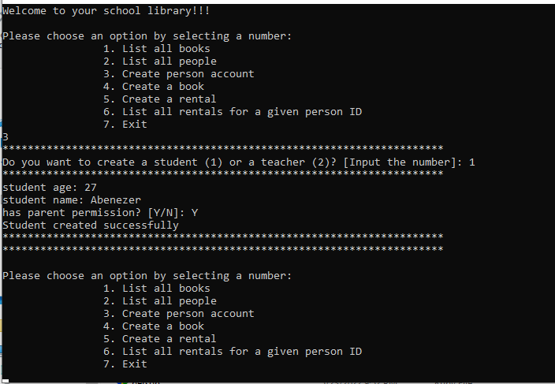

# OOP School Library

This is an implementation of a tool to record what books are in the library and who has borrowed them. The app that you will create will allow you to:

- Add new students or teachers.
- Add new books.
- Save records of who borrowed a given book and when.
- Added unit test for classes using Rspec.

## General info
This is project made with Ruby, with a basic UI(command line). User can create Person(teacher and student) .

 ## Technologies

Project is built by:using: 
* Ruby 
* OOP principles 
* Apply SOLID principles
* Apply Unit test using Rspec

And created with

* GitFlow
* Github
* Visual Studio Code
* rvm

## Getting Started

To get a local copy up and running follow these simple example steps.

- go to the directory that you want to clone the repository in.
- right click and choose Git Bash here.
- type git clone https://github.com/Abenezer-Tilahun/OOP-school-library.git
- go to the repository folder in your command prompt.
- run bundle install.

or

- ruby main.rb
- To Test school library Run rspec spec file.rb(Just like rspec spec .\spec\classroom_spec.rb)

## Author

👤 **Abenezer Tilahun**

- GitHub: [@Abenezer-Tilahun](https://github.com/Abenezer-Tilahun)
- Twitter: [@AbenezerTilah11](https://twitter.com/AbenezerTilah11)
- LinkedIn: [Abenezer Tilahun](https://www.linkedin.com/in/abenezer-tilahun/)

👤 **Vignesh**

- GitHub: [@Vignesh](https://github.com/vikipretium)
- LinkedIn: [Vignesh Pasupathy](https://www.linkedin.com/in/vikipretium/)

## 🤝 Contributing

Contributions, issues, and feature requests are welcome!

Feel free to check the [issues page](https://github.com/Abenezer-Tilahun/OOP-school-library/issues).

## Show your support

Give a ⭐️ if you like this project!

## Acknowledgments

- A special thanks to Microverse.
- My coding partner(@vignesh)

## 📝 License

This project is [MIT](LICENSE) licensed.